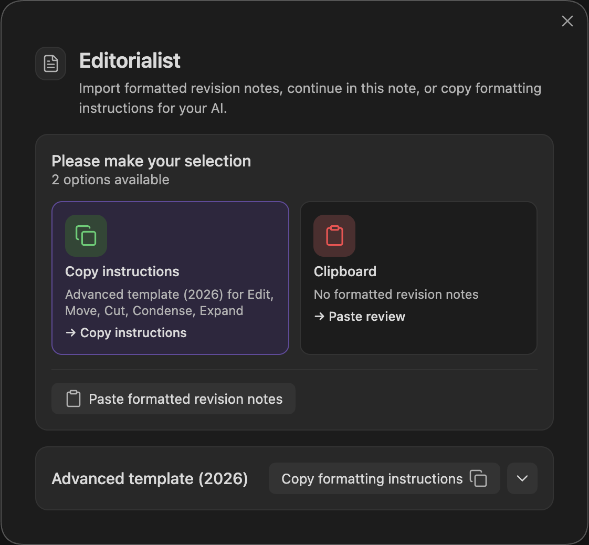

## Install

Editorialist is **desktop only** — it won't appear or load on Obsidian mobile.

Install from the Obsidian Community Plugins directory:

1. In Obsidian: **Settings → Community plugins → Browse**, search for **Editorialist**.
2. Install, then enable it.

(To install a specific version manually, grab `manifest.json`, `main.js`, and `styles.css` from the [latest release](https://github.com/EricRhysTaylor/Editorialist/releases) and place them in `<your-vault>/.obsidian/plugins/editorialist/`.)

If you also use [Radial Timeline](Radial-Timeline-Integration.md), Editorialist detects it automatically and scopes review tools to the active book. It is optional; everything below works without it.

## Commands

Editorialist registers these commands in the command palette:

| Command | What it does |
|---|---|
| **Open review launcher** | Opens the launcher modal to import a review batch or start a pending-edits review |
| **Open review panel** | Opens the [Review Panel](Review-Panel.md) in the sidebar |
| **Review pending edits in active book** | Starts the pending-edits review flow across the active book |
| **Backup selection to cut file** | Copies selected text to the scene's cut file without changing the manuscript |

Editorialist ships **no default hotkeys** — assign your own under **Settings → Hotkeys** if you want them.

## Your first review sweep

A five-minute walkthrough of the core loop:

### 1. Copy the template

Run **Open review launcher** and click **Copy formatting instructions**. This copies the review batch format, the Editorialism file format, and (with Radial Timeline) your book's actual scene IDs to the clipboard.

### 2. Get suggestions

The formatting instructions are written for an AI — a human reviewer never works from them directly.

**AI review:** paste the instructions into your AI conversation along with the prose to review. The AI replies with a [review batch](Importing-Reviews.md#format-a--the-review-batch).

**Human feedback:** your editor or beta reader works however they naturally work — margin notes on a printed page, comments in a document, an email. Collect their notes in whatever form they arrive (a photo of the handwritten page, the electronic doc) and hand them to an AI along with the formatting instructions. The AI shapes everything into a properly formatted batch for Editorialist, with your human reviewer credited as the contributor.

For a normal review sweep, you want a **review batch**. It contains scene-targeted suggestions. An **Editorialism** is different: it is a separate structural checklist for broad guidance that spans scenes or the whole manuscript.

### 3. Import the batch

Copy the reviewer's reply and run **Open review launcher** again. The launcher detects the review batch on your clipboard — one click imports it. (If detection misses, paste manually; validation runs as you type.) Editorialist appends a review block to the bottom of each targeted scene note. **Nothing has been applied to your prose yet.**

### 4. Walk the sweep

The [Review Panel](Review-Panel.md) opens a guided sweep: each suggestion is highlighted in the editor with a toolbar — apply it, reject it, rewrite it yourself, defer it for later, or back the text up to a cut file first. The sweep advances scene by scene through the batch.

### 5. Finish

When every suggestion is resolved, the sweep completes and the batch is recorded: per-scene polish state, contributor stats, and revision history all update. The **Core** settings tab shows your progress across the whole book — see the [Settings Reference](Settings-Reference.md).

## Where things live in your vault

| Path | What it is |
|---|---|
| Your scene notes | Review blocks are appended here on import, removed on cleanup |
| `Editorialist/<Book>/` | [Editorialism](Editorialisms-Panel.md) structural guidance documents |
| `<book-source-folder>/Cut/` | Per-scene cut files (default location; [configurable](Settings-Reference.md#configuration-tab)) |
