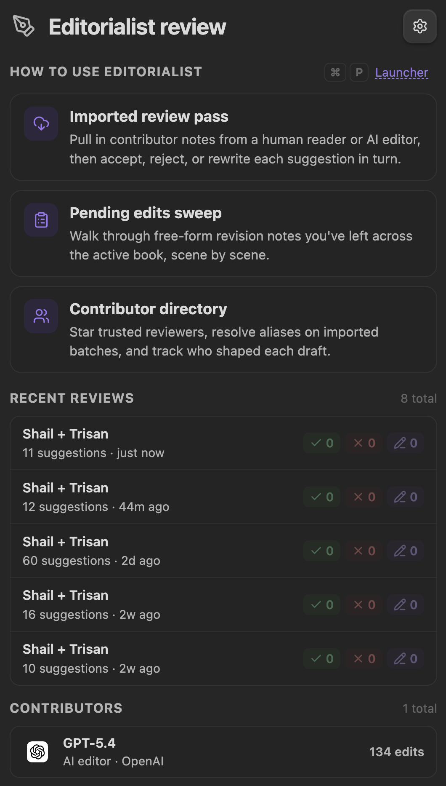
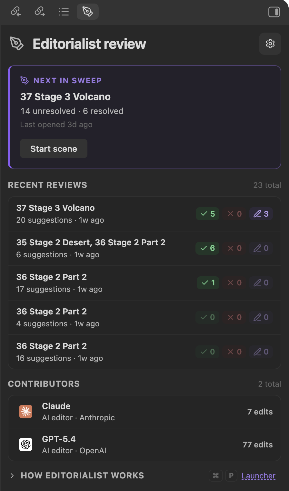
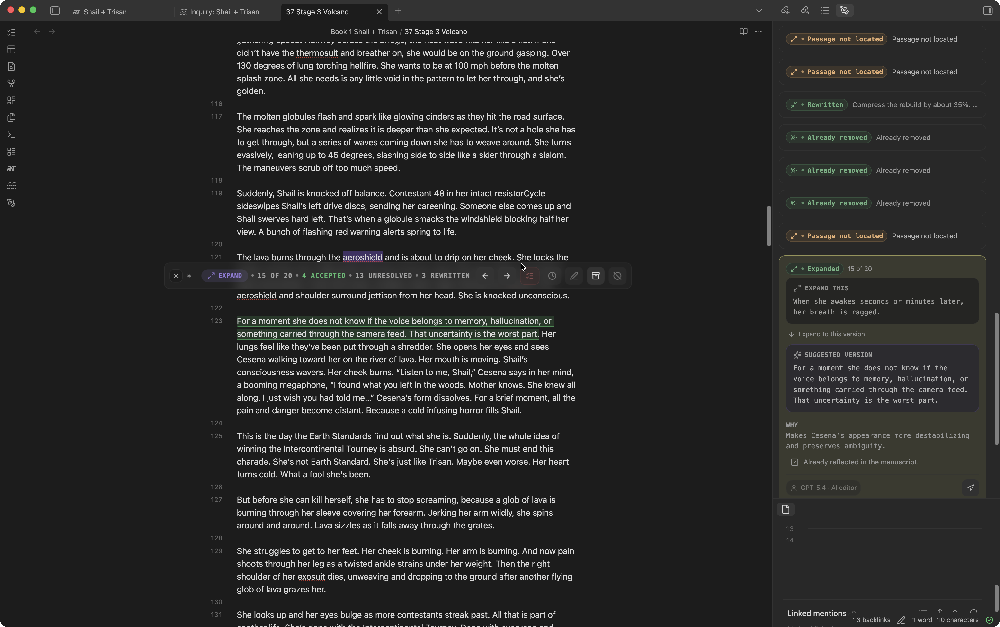
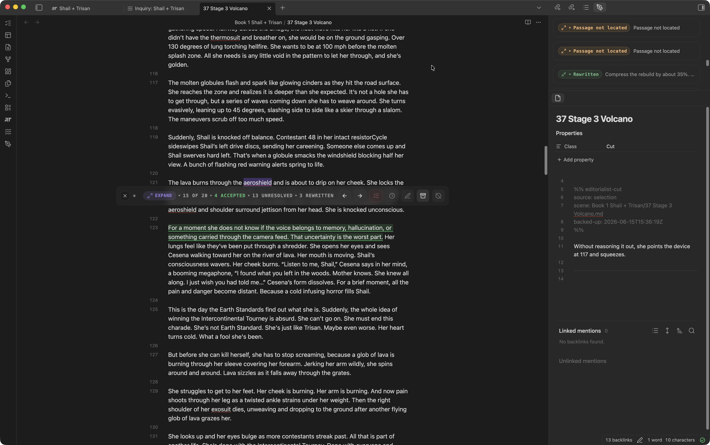

The Review Panel is Editorialist's main working surface — a sidebar view that drives review sessions and shows the state of the active book between them. Open it with the **Open review panel** command.

## Idle state

<p align="center"></p>

Between sessions the panel shows:

- **Active book** — which book Editorialist is currently scoped to (via [Radial Timeline](Radial-Timeline-Integration.md) when installed).
- **Pending workflow cards** — imported batches and pending edits waiting for review, each with a start button.
- **Recent activity** — the latest decisions and completed sweeps.
- **Contributors** — a compact view of who has been suggesting what.
- **Onboarding** — a collapsible getting-started disclosure for new vaults.

### Panel controls

<p align="center"></p>

The header controls keep the most common actions close to the review panel:

| Control | What it does |
|---|---|
| **Toggle modes** | Switch between the review panel and [Editorialisms](Editorialisms-Panel.md). |
| **Clean imported notes** | Remove review notes after you are done with them. |
| **Import batch** | Paste in a formatted review batch and route it into matching scenes. |
| **Insert author query** | Add a hidden inline question for the next review pass. |
| **Back up selection** | Copy selected manuscript text into the scene's cut file. |
| **Settings** | Open Editorialist settings. |

## Review sessions

Starting a workflow card (or importing a review batch) begins a **guided review sweep**. The imported batch has already been split into review blocks at the bottom of the targeted scene notes; the panel reads those blocks and walks their suggestions scene by scene.

<p align="center"></p>

### Navigation and filters

- **Previous / next** moves through suggestions; the sweep hands off to the next scene when the current one is resolved.
- **Jump to** — each suggestion card has a jump menu: jump to the suggested text in the editor, to its source review block, or (for a move) to the destination anchor.
- **Contributor filter** — appears only when a session contains suggestions from **more than one contributor**. A dropdown limits the view to one contributor, and a star button shows only [starred contributors](Settings-Reference.md#contributors-tab). With a single-reviewer batch the row stays hidden.
- **Collapse controls** — fold away processed suggestions, pending edits, and comments to reduce noise.

### The suggestion toolbar

<p align="center"></p>

Each highlighted suggestion gets an inline toolbar in the editor:

| Action | Trigger | Effect |
|---|---|---|
| **Apply** (Edit / Cut / Condense / Expand / Move) | Click | Apply this suggestion to the prose |
| **Apply and advance** | Shift + click | Apply, then jump to the next suggestion |
| **Apply to all** | Shift + Cmd + click | Apply every applicable suggestion of this kind |
| **Defer** | Click | Skip for now; the sweep can finish later |
| **Rewrite myself** | Click | Take the suggestion as a prompt and write your own version |
| **Backup to cut file** | Click | Archive the target text to the [cut file](Settings-Reference.md#configuration-tab) before deciding |
| **Open cut file** | Shift + click Backup to cut file | Open the scene's cut file |
| **Reject** | Click | Decline the suggestion |
| **Hide toolbar** | Click | Dismiss the overlay without deciding |

### Cut-file preview

<p align="center"></p>

When you use **Backup to cut file**, Editorialist writes the selected passage to the scene's cut file before you decide what to do with the suggestion. The cut file keeps the archived text with source metadata, while the review suggestion stays active until you accept, reject, rewrite, or defer it.

### Suggestion statuses

Every suggestion moves through an explicit lifecycle:

```
pending ──→ accepted
       ──→ rejected
       ──→ rewritten   (you applied your own version)
       ──→ deferred    (decide later; blocks sweep completion until resolved)
       ──→ unresolved  (couldn't be matched or needs attention)
```

Decisions are undoable during the session. Suggestions whose target text can't be found in the note (paraphrased targets, already-applied edits) are flagged by match type — exact, multiple matches, not found, or already applied — so nothing is ever applied against the wrong text.

### Sweep completion

A sweep finishes only when every suggestion in the batch has a resolved status (accepted, rejected, or rewritten). If pending, unresolved, or deferred items remain, Editorialist pauses and tells you what's left. On completion, the batch is recorded: per-scene polish frontmatter (`Editorialist.revision`, `Editorialist.revision_updated`), contributor acceptance stats, and the activity history all update.

## Pending-edits review

Separate from imported batches, Editorialist can collect **free-form revision notes** sitting in your scene frontmatter — your own notes-to-self plus Inquiry View insertions — and walk them the same way. Start it from the **Review pending edits in active book** command, the launcher, or the **Start review** button on the [Core settings tab](Settings-Reference.md#core-tab).

With [Radial Timeline](Radial-Timeline-Integration.md) installed, Editorialist uses the active book's scenes and gathers every scene with pending edits. Each note is presented one at a time with context jumping into the scene, and you record an accept/reject decision per segment.
