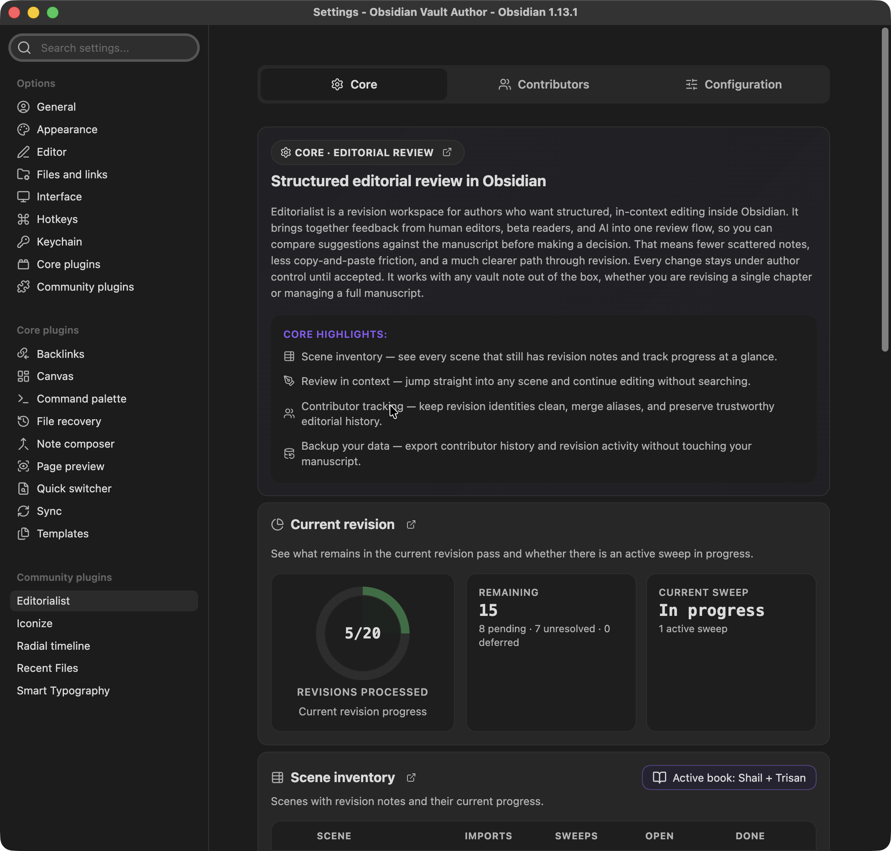
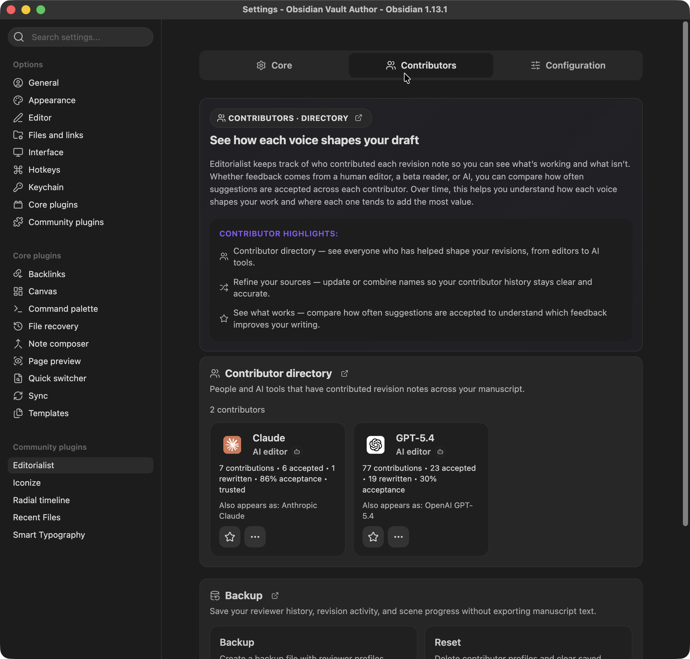
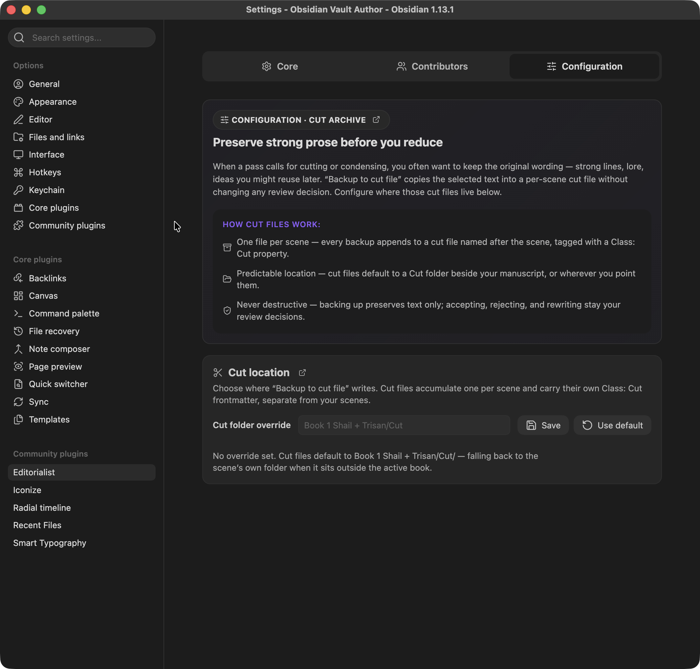

# Settings Reference

Editorialist's settings are organized into three tabs: **Core**, **Contributors**, and **Configuration**. The Core tab doubles as the plugin's dashboard — most of it is live status, not knobs.

---

## Core tab

**Core · Editorial review** — the dashboard for the active book's revision state.

### Radial Timeline card

If the [Radial Timeline](Radial-Timeline-Integration.md) plugin is not installed, a card explains what it adds and links to install it. With it installed, Editorialist scopes everything below to the active book.

### Revision progress

A pie chart of the current revision's completion, with metrics: tracked scenes, and remaining / accepted / rejected / rewritten counts.

### Scene inventory

A table of every tracked scene in the active book:

| Column | Meaning |
|---|---|
| Completion | Per-scene polish state, from `Editorialist:revision` / `Editorialist:revision_updated` frontmatter |
| Scene | Scene name; with Radial Timeline installed, Status glyphs (**T**odo / **W**orking / **C**omplete) and Stage glyphs (**Z**ero / **A**uthor / **H**ouse / **P**ress) render from shared frontmatter |
| Imports | Review batches imported into the scene |
| Sweeps | Completed guided review sweeps |
| Open / Done | Suggestion counts |

Scenes with pending edits show a badge. An active-book filter button narrows the table.

### Pending edits

Summary of the free-form revision notes collected from scene frontmatter: scene count, item count, human notes, and inquiry count — with a **Start review** button that launches the [pending-edits flow](Review-Panel.md#pending-edits-review) (disabled when there's nothing to review).

### Activity

Lifetime totals: suggestions processed, accepted / rejected / rewritten, completed sweeps.

### Tracking

Shows which tracking mode is active and why:

| Mode | When |
|---|---|
| Radial Timeline based | RT installed and an active book is set — scenes tracked by RT's stable scene IDs |
| Using stable note IDs | RT absent; Editorialist injects and tracks its own stable note IDs |
| Path-based tracking fallback | Neither available — scenes tracked by file path (fragile across renames) |

The **Inject stable note IDs** action upgrades a vault from path-based tracking. Tracked and missing counts are shown alongside.

### Maintenance

Bulk operations. All of them require confirmation before touching anything:

- **Clean all notes/scenes** — remove review blocks from notes.
- **Clean completed notes/scenes** — remove only fully-resolved review blocks.
- **Reset one batch** — pick a batch from a list and remove its history.
- **Reset all history** — clear all revision history.

### About

Author, version, and links to GitHub, releases, issues, and docs.

---

## Contributors tab

**Contributors · Directory** — every reviewer who has ever contributed a batch, human or AI.

### Contributor directory

A card grid, one per contributor:

- **Identity** — display name, avatar (or AI provider brand icon, derived from the `Provider:` / `Model:` batch metadata), role icon, and strength icons.
- **Stats** — total suggestions, accepted, rewritten, and acceptance percentage.
- **Trusted badge** — earned at ≥5 suggestions with ≥80% acceptance.
- **Aliases** — alternate names that have been merged into this contributor.
- **Star** — mark a contributor to enable the starred-only filter in the [Review Panel](Review-Panel.md).
- **Manage (…)** — opens contributor actions:
  - *Edit identity* — display name, role (e.g. human-editor, beta-reader, ai-editor), and strengths (dialogue, structure, prose-level, continuity, pacing, fact-check, sensory-detail).
  - *Merge / reassign* — move all suggestions from one contributor to another (existing or newly created). Use this when the same person shows up under two names.

### Backup

- **Export backup** — writes a JSON file containing reviewer profiles, aliases, starred status, and revision history. **Metadata only — never manuscript text.**
- **Delete all contributors** — clears the directory and stats. Accept/reject decisions already recorded in your notes are preserved.

---

## Configuration tab

**Configuration · Cut archive** — where cut text gets preserved.

When you accept a **Cut** suggestion (or use **Backup to cut file** from the suggestion toolbar), the removed text is archived to a per-scene cut file — one cut file per scene, named after the scene and tagged with its own `Class: Cut` frontmatter, with hidden metadata per entry: the operation, the contributor, the reason, and a timestamp. Cut files never touch review status or acceptance decisions — they are a safety net, not part of the workflow state.

### Cut location

- **Cut folder override** — a path field. Leave empty to use the default: `<book-source-folder>/Cut` when a book context exists, otherwise `<scene-folder>/Cut`.
- **Save** / **Use default** buttons apply or clear the override.

---

## Safety model (applies everywhere)

- No network requests, no account, no telemetry.
- Notes are modified only when you explicitly import a batch, apply a suggestion, clean review blocks, or run a maintenance action.
- Every bulk maintenance action requires confirmation.
- Backup export contains contributor and revision metadata only — never manuscript text.
